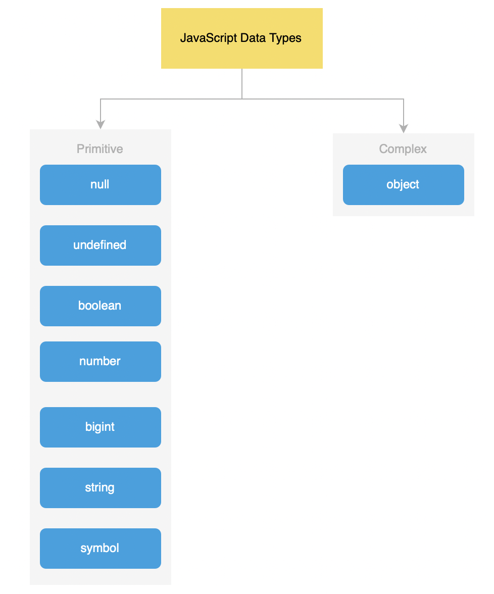
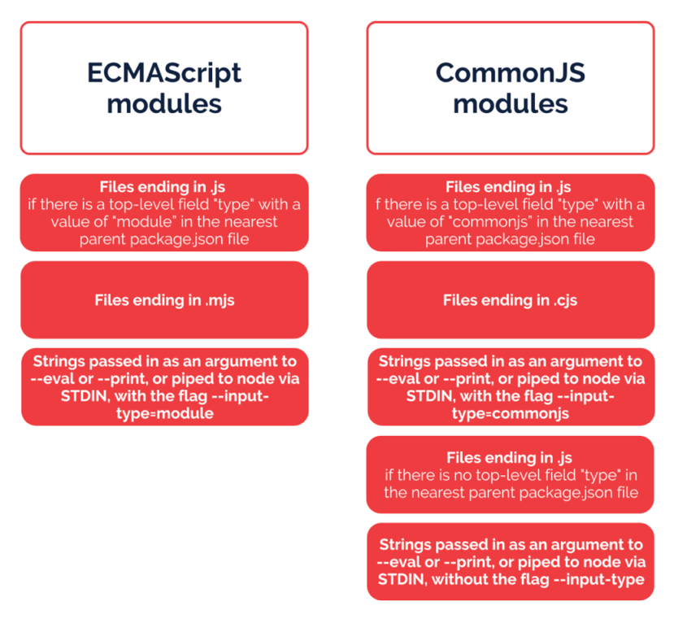
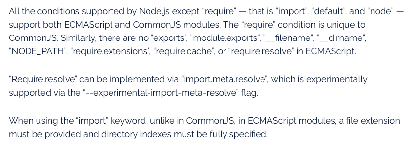
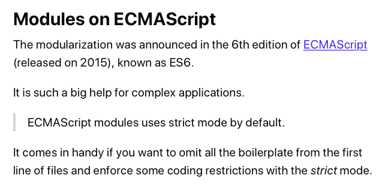

# 📚 JavaScript: breves anotaciones sobre el lenguaje  

Listado personal de anotaciones, trucos, recordatorios, utilidades o ejemplos interesantes para JavaScript.  

## Tabla de Contenido
- [Versiones de JavaScript](#versiones-de-javascript)
- [Tipos de datos](#tipos-de-datos)
- [Declaración de variables](#declaracion-de-variables)
- [Operadores](#operadores)
- [Condicionales](#condicionales)
- [Funciones, parámetros y argumentos](#funciones-parámetros-y-argumentos)
- [Clases en ES6](#clases-en-es6)
- [Clases en ES2019](#clases-en-es2019)
- [Singleton (ES6 clase)](#singleton-es6-clase)
- [Tratamiento de arrays](#tratamiento-de-arrays)
- [Tratamiento de strings](#tratamiento-de-strings)
- [Regular expressions](#regular-expressions)
- [Objetos](#objetos)
- [Namespaces](#namespaces)
- [Closures](#closures)
- [Curry functions](#curry-functions)
- [Proxies](#proxies)
- [Set](#set)
- [Map](#map)
- [Debugging y console](#debugging-y-console)
- [De callback hell a promesas](#de-callback-hell-a-promesas)
- [Promesas](#promesas)
- [Async-Await](#async-await)
- [setTimeout](#settimeout)
- [setInterval](#setinterval)
- [DOM](#dom)
- [ECMAScript modules vs CommonJS modules on Node.js](#ecmascript-modules-vs-commonjs-modules-on-nodejs)
- [unhandledRejection on Node.js](#unhandledrejection-on-nodejs)
- [Switch vs mapper](#switch-vs-mapper)
- [API Intl](#api-intl)
- [Navigator Interface](#navigator-interface)


----------------------------------------------------------
## Versiones de JavaScript: 

  

### **Compatibilidades con Node.js**  
 [https://node.green](https://node.green)

### **Compatibilidades con navegadores (exceptuando IE11)**  
* En junio de 2021, ES2017 está totalmente soportado en todos los navegadores principales de escritorio y móvil

----------------------------------------------------------
## Tipos de datos:  

Hay dos conjunto de tipos en JavaScript: 
* Los tipos primitivos: `null` (aunque en realidad es un objeto especial), `undefined`, `boolean`, `number` (incluyendo `NaN`), `string`, `symbol` y `bigint`
* Los tipos objeto: `Object`, `Array`, `Map`, `Set`, `Date`, `Error`, `Promise`, ...

 

----------------------------------------------------------
## Declaración de variables:  

* Declarar múltiples variables de manera más compacta:
```javascript
var i, j, k;
var l = m = n = 0;
var a = 1, b = 2;
```

----------------------------------------------------------
## Operadores:  

* Operador lógico _OR_ (evalua de izquierda a derecha las expresiones y retorna la primera de ellas evaluable como "truthy". Si todas se evaluan como "falsy", retorna _false_. Todos los valores son "truthy", excepto: _false_, _0_, _""_, _null_, _undefined_, y _NaN_)
```javascript
var foo = false || '🙂'; // '🙂'

var bar = 3 || false; // 3

var foobar = null || 0 || undefined || "NyanCat"; // "NyanCat"
```

* Operador ternario: _?_:
```javascript
var now = new Date();  
var greeting = "Good" + ((now.getHours() > 17) ? " evening." : " day.");
console.log(greeting);
```

* Operador _spread_:
```javascript
let foo = ['foo 1', ' foo 2'];
let bar = ['bar 1', 'bar 2', ...foo, 'bar 3'];
console.log(bar); // ["bar 1", "bar 2", "foo 1", " foo 2", "bar 3"]
```

* Doble uso del operador _!_ (not):
```javascript
// La doble negación retorna un booleano dependiendo de la "truthiness" de la expresión.
// Retornará false cuando el valor sea: false, 0, "", null, undefined, y NaN.
// Si no es ninguno de estos casos, entonces devolverá true.
// Tiene sentido usarlo para evaluar expresiones que no son booleanas.
let foo;
if (!!foo) { // 'Result is false' Dado que el valor de foo es null.
	console.log('Result is true');
} else {
	console.log('Result is false');
}

// Observa los siguientes ejemplos:
!!0 // false
!!1 // true
!!"" // false (string vacío es falsy)
!!window.biz // false (si la variable biz no está declarada, se evalua como falsy)
!!undefined // false (undefined es falsy)
!!null // false (null is falsy)
!!{} // true (an empty object is truthy)
!![] // true (an empty array is truthy. PHP programmers beware!)
!!NaN // false
```

* Nullish coalescing operator (??):
```javascript
// Node.js 14 required (ES2020)

0 ?? 'default' // 0
'' ?? 'default' // ''
false ?? 'default' // false
NaN ?? 'default' // NaN
null ?? 'default' // 'default'
undefined ?? 'default' // 'default'
undefined ?? null // null
null ?? undefined // undefined
```

* Optional chaining operator (?.):
```javascript
// Node.js 14 required (ES2020)
const object = { id: 123, names: { first: 'Alice', last: 'Smith' }};
const firstName = object?.names?.first; // 'Alice'
const home = object?.address?.home; // undefined

// En combinación con nullish coalescing operator:
const middleName = object?.names?.middle ?? '(no middle name)'; // '(no middle name)'


const user = {};
alert(user.address.street); // Error!
alert( user && user.address && user.address.street ); // undefined (no error)
alert( user?.address?.street ); // undefined (no error)


// the evaluation stops immediately after: car?.
const car = null;
alert( car?.motor.valves.anything ); // undefined
```


----------------------------------------------------------
## Condicionales:  

* Condicional _if_ comparando múltiples criterios:
```javascript
const fruit = 'strawberry';

// Creamos un array con aquellos criterios a los que comparar
const criteria = ['apple', 'strawberry', 'cranberries'];

if (criteria.includes(fruit)) {
	// true
}
```

----------------------------------------------------------
## Funciones, parámetros y argumentos:  

* Parámetros vs argumentos. Un parámetro es una variable en la declaración de la función. Un argumento es el valor que le pasas a una función en el momento de ser llamada:
```javascript
function sayHi(name) { // 👈 parameter
}

sayHi('samantha'); // 👈 argument
```


* _arguments_ (array de argumentos que se le pasan a una función):
```javascript
function printArgumentsES6(...arg){
	arg.forEach((a) => console.log(a));
}
printArgumentsES6(3712,7123);

function printArgumentsES6ForOf(){
	for(let argument of arguments){
		console.log(argument);
	}
}
printArgumentsES6ForOf(3712,7123);


function food(...arg){
	const [egg, cheese] = args;
}
food('🥚', '🧀');
```

* Uso de destructuring para mejorar la legibilidad del siginificado de los parámetros que mandamos a una función:
```javascript
function createMenu({ title, body, buttonText, cancellable=false }) {
	// ...
	// Fíjate que establecemos un valor por defecto al argumento "cancellable"
}

createMenu({
	title: 'my title',
	body: 'my body',
	buttonText: 'send form',
	cancellable: true
}); // observa que así es totalmente comprensible el significado de los parámetros. A esto lo llamamos "named parameters".
// Sin embargo, no hubieramos entendido nada así: createMenu('my title', 'my body', 'send form', true);
// ¿Sabríamos entender que significa el true en la segunda llamada? Probablemente no!

// Podemos hacer lo siguiente si todos los parámetros son opcionales:
function createUser({ username = 'Anonymous' } = {}) {
	// ...
}
// de esta manera podemos llamar a la función así:
createUser();

// Observa que si nuestras funciones también retornan objetos, estás usando el patrón RORO (receive object, return object).
```

* Self Invoking Functions, también llamadas IIFE (Immediately Invoked Function Expression):
```javascript
var hello;
(function (){

	hello = function(){
		return "Hi boy!";
	};

})();

console.log( hello() ); // "Hi boy!"


var result = (function () {
	var name = "Barry";
	return name;
})();

console.log(result); // El contenido de la variable result es el resultado de la ejecución de la función.
// En este caso: "Barry"
```

* Factory Functions (una "Factory Function" es una función que crea objetos y los retorna):
```javascript
// Ejemplo de Factory Function
const cat = () => {

	const sound = 'miau';
	let color = 'white';

	// definimos getters and setters para acceder a las propiedades
	const setColor = (newColor) => {
		color = newColor;
	}
	const getColor = (newColor) => {
		return color;
	}

	return {
		talk: () => sound,
		setColor,
		getColor
	}
}

const smurfy = cat(); // No debes usar "new"!
console.log( smurfy.talk() ); // miau
// console.log( smurfy instanceof cat ); // TypeError
console.log( smurfy.getColor() ); // 'white'
smurfy.setColor('black');
console.log( smurfy.getColor() ); // 'black'


// Otro ejemplo potenciando el uso de "closures"
const makeCounter = function() {
	// propiedades privadas
	let _count = 0;

	// métodos privados
	const changeBy = (val) => {
		_count += val;
	}

	// definimos los métodos publicos
	return Object.freeze({
		increment: function() {
			changeBy(1);
		},
		decrement: function() {
			changeBy(-1);
		},
		getValue: function() {
			return _count;
		}
	})
};

const Counter1 = makeCounter();
const Counter2 = makeCounter();

console.log(Counter1.getValue()); // 0

Counter1.increment();
Counter1.increment();
console.log(Counter1.getValue()); // 2

Counter1.decrement();
console.log(Counter1.getValue()); // 1

console.log(Counter2.getValue()); // 0
```

Otro ejemplo de _Factory Functions_ más avanzado:
```javascript
// Ejemplo avanzado de Factory Function:
const dataConnection = (data = {}) => {
	const settings = data; // Guardo los parámetros que me han pasado al llamar a la factory function.
	// De esta manera puedo definir propiedades del nuevo objeto.
	
	return Object.freeze({
		// Object.freeze evita la eliminación y adición de propiedades, modificación del prototype, etc.
		getSettings: () => settings,

		modifySettings: (addData = {}) => {
			return Object.assign(settings, addData); 
		// Añadimos al objeto 'settings' nuevas propiedades
		// o bien modificamos el valor de las existentes.
		}
	});
}

const connection = dataConnection( { ip: '127.0.0.1', port: '8080' } );
// Le paso como parámetro un objeto

console.log( connection.getSettings() ); // {ip: "127.0.0.1", port: "8080"}
console.log( connection.getSettings().ip ); // 127.0.0.1

connection.method = 'http'; // Esto NO funcionará!
// Gracias a 'Object.freeze' no puedo añadir propiedades al objeto.
// Sólo veré un error si uso: 'use strict';

//connection.settings.method = 'http'; // Esto NO funcionará! TypeError

connection.modifySettings( { method: 'http' } );
// Usamos un método definido en el objeto para modificar los valores que contiene el objeto.

console.log( connection.getSettings() ); // {ip: "127.0.0.1", port: "8080", method: "http"}

connection.modifySettings( { ip: '192.168.2.11' } );
// Podemos sobreescribir los valores del objeto 'settings'.

console.log( connection.getSettings() ); // {ip: "192.168.2.11", port: "8080", method: "http"}
```

----------------------------------------------------------
## Clases en ES6

* Ejemplo de clase en ES6:
```javascript
class Person {
	constructor(name) {
		// constructor es un método opcional. Si la clase no tiene propiedades puedes omitirlo
		this.name = name;
	}

	salute() {
		console.log(`Hello, my name is ${this.name}`);
	}
}

let john_doe = new Person("John Doe");

john_doe.salute(); // Hello, my name is John Doe

console.log(john_doe instanceof Person); // true
console.log(john_doe instanceof Object); // true

console.log( typeof john_doe); // object

console.log( typeof Person); // function !!
// (Cuidado, podríamos pensar que no retornará "class" pero nos retorna "function")

console.log( typeof Person.prototype.salute); // function !!
// (Cuidado, podríamos pensar que no retornará "method" pero nos retorna "function")
```

* Ejemplo de Chaining Methods (métodos encadenados):
```javascript
class Car {
	constructor(brand, model, color) {
		this.brand = brand;
		this.model = model;
		this.color = color;
	}

	setBrand(brand) {
		this.brand = brand;
		return this; // Returning this for chaining
	}
	setModel(model) {
		this.model = model;
		return this; // Returning this for chaining
	}
	setColor(color) {
		this.color = color;
		return this; // Returning this for chaining
	}

	getCarInfo() {
		return this; // Returning this for chaining
	}
}

const car = new Car('Ford','F-150','red').setColor('pink').setModel('Fiesta'); // Chaining methods!

console.log( car.getCarInfo() ); // {brand: "Ford", model: "Fiesta", color: "pink"}
```


* Métodos estáticos (nos permite usar esos métodos sin generar la instancia de la clase):
```javascript
class Utilities {
	static getRandomInteger() {
		// Esto es un método estático. 
		// Permite ser llamado sin necesidad de instanciar la clase.
		return Math.floor(Math.random() * 11); // retorna número entero aleatorio entre 0 y 10
	}

	static coinToss() {
		return Math.random() > 0.5; // retorna "true" o "false" de manera aleatoria
	}

	static capitalize(str) {
		return str.charAt(0).toUpperCase() + str.slice(1); // retorna un string poniendo en mayúscula la primera letra
	}

	static delay(milliseconds, callback) {
		setTimeout(callback, milliseconds);
	}

	static trimToTwoDecimalPoints(number) {
		const fixed = 2;
		return ~~(Math.pow(10, fixed) * number) / Math.pow(10, fixed);
	}

	/**
	 * Get a random float between the min and max parameters
	 *  @example
	 *      getRandomPriceBetweenRange(6, 7); // 6.98
	 * @param {number} min
	 * @param {number} max
	 * @returns {number}
	 */
	static getRandomPriceBetweenRange(min, max) {
		const randomNumber = Math.random() * (max - min) + min;
		return Number(randomNumber.toFixed(2));
	}

	static pause(milliseconds) {
		const start = Date.now();
		let now = start;
		while (now - start < milliseconds) {
			now = Date.now();
		}
	}

	static waitFor(milliseconds) {
		return new Promise(resolve => setTimeout(resolve, milliseconds));
	}

	static generateToken() {
		const chars = 'ABCDEFGHIJKLMNOPQRSTUVWXYZabcdefghijklmnopqrstuvwxyz0123456789#*'; // Don't modify the length
		let rand;
		let index;
		let bits = 64;
		let result = '';
		while (bits > 0) {
			rand = Math.floor(Math.random() * 0x100000000); // 32-bit integer
			// base 64 means 6 bits per character, so we use the top 30 bits from rand to give 30/6=5 characters.
			for (index = 26; index > 0 && bits > 0; index -= 6, bits -= 6) {
				result += chars[0x3F & (rand >>> index)];
			}
		}

		return result;
	}

	static randomString() {
		const length = 16;
		const characters = 'ABCDEFGHIJKLMNOPQRSTUVWXYZabcdefghijklmnopqrstuvwxyz0123456789';
		const charactersLength = characters.length;

		let result = '';

		while (result.length < length) {
			result += characters.charAt(Math.floor(Math.random() * charactersLength));
		}

		return result;
	}
}

let num = Utilities.getRandomInteger(); // Llamamos directamente al método estático
console.log(num); // 2

console.log(Utilities.coinToss()); // true | false

console.log(Utilities.capitalize('batman')); // 'Batman'

Utilities.delay(3000, function () {
	return console.log('delayed output');
}); // 'delayed output', tres segundos después

Utilities.generateToken(); // 'DyvlJ*mhQ8X'

Utilities.pause(2000); // Stop the execution of JavaScript for the specified time

// waitFor() example:
Utilities.waitFor(5000).then(() => doSomething());

// or even...
await Utilities.waitFor(5000);
doSomething();

```

* Herencia:
```javascript
class Rectangle {
	constructor(len, wid) {
		this.len = len;
		this.wid = wid;
	}

	getArea() {
		return this.len * this.wid;
	}

	getInfo () {
		return 'I am a naughty rectangle!';
	}
}

class Square extends Rectangle { // extendemos la clase
	constructor(len) {
		super(len, len); // Invocamos al constructor de la clase padre
	}

	// Podría hacer referencia al método del padre, pero no es necesario!
	// Puedo omitirlo, ya que el método es heredado automáticamente.
	// getArea() {
	// 	return super.getArea(); // Fíjate que así invoco a un determinado método del padre.
	// }

	// Sobreescribir un método
	getInfo () {
		return 'I am a cheeky square!';
	}
}

let square = new Square(4);
console.log(square.getArea()); // 16. Observa que este método ha sido hererado de la clase padre

console.log(square instanceof Square); // true
console.log(square instanceof Rectangle); // true. Recuerda que Square extiende la clase Rectangle

console.log(square.getInfo()); // I am a cheeky square!
```

----------------------------------------------------------
## Clases en ES2019

* Ejemplo de clase en ES2019:
```javascript
// Node.js 12.4 required

class MyES2019Class {
	// ya no es necesario el constructor para declarar las propiedades públicas (pero puedes usarlo si lo necesitas).

	x = 1; // public property

	#counter = 0; // private property

	static z = 3; // static property

	incB() {
		this.#counter++;
	}

	getCounter () {
		return this.#counter
	}

}

let foo = new MyES2019Class();

foo.incB(); // runs OK
foo.#counter = 7; // error - private property cannot be modified outside class
foo.#counter; // error - private property cannot be read outside class
foo.counter; // undefined

foo.getCounter(); // 1
```

----------------------------------------------------------
## Singleton (ES6 clase):

* Ejemplo de singleton pattern usando clases de ES6:
```javascript
class Item {
	constructor(){
		if (Item.instance) {
			return Object.freeze(Item.instance);
		}
		this._data = [];
		Item.instance = this;
	}

	// Methods
	add(item){
		this._data.push(item);
	}

	get(id){
		return this._data.find(d => d.id === id);
	}
}

// Puedes exportar esta clase como un módulo:
module.exports = Item;

// Impórtalo así:
const Item = require('./Item');
const foo = new Item();

let first = new Item();
let second = new Item();

first.add( { id: 1, name: 'john' } );
first.add( { id: 2, name: 'louis' } );

console.log(second); // [ {id: 1, name: "john"}, {id: 2, name: "louis"} ]

console.log(second.get(2)); // { id: 2, name: 'louis' }

console.log(first===second); // true (son la misma instancia)
```

----------------------------------------------------------
## Tratamiento de arrays:

* Crear un array con _n_ número de posiciones con un valor por defecto
```javascript
new Array(3).fill(0); // [0,0,0]
```

* Clonar un array
```javascript
/**
 * recursiveArrayClone() Crea un clon exacto de un array. Soporta matrices multidimensionales.
 *
 * @code
 * 	console.log( recursiveArrayClone( ['a', {}, [4, 0]] ) ); // ['a', {}, [4, 0]]
 * @endcode
 *
 * @param {array} arrayToClone. El array que se quiere clonar.
 * @return {array} clonedArray. Retorna un nuevo array.
 */
function recursiveArrayClone(arrayToClone){
	let clonedArray = [];
	for (let i = 0; i < arrayToClone.length; i++) {
		if ( Array.isArray(arrayToClone[i]) ) {
			clonedArray.push( recursiveArrayClone(arrayToClone[i]) );
		} else {
			clonedArray.push(arrayToClone[i]);
		}
	}
	return clonedArray;
}
```

* Vaciar un array
```javascript
const myArray = ['a', 'b', 'c'];
myArray.length = 0;
console.log(myArray); // []
```

* Quitar elementos _falsy_ de un array
```javascript
const myArray = [0, "0", "example", null, undefined, NaN, false];

let arrayFiltered = myArray.filter(Boolean);
console.log(arrayFiltered); // ["0", "example"]
```

* Uso de: _array.join_ (retorna un string)
```javascript
let a = ['Wind', 'Rain', 'Fire'];
a.join();      // 'Wind,Rain,Fire'
a.join('');    // 'WindRainFire'


let text = "Add the potato please, I always prefer more potato";
text = text.split("potato").join("cheese");
// Sustituye "potato" por "cheese" en todas las apariciones que haya en "text"
```

* Uso de: _array.concat_ (crea un nuevo array con la concatenación de 2 o más arrays)
```javascript
const arr1 = ['a', 'b', 'c'];
const arr2 = ['d', 'e', 'f'];
const arr3 = arr1.concat(arr2); // arr3 is a new array [ "a", "b", "c", "d", "e", "f" ]
```

* Uso de: _array.slice_ (crea una copia del array pero quitando, o no, algunos elementos del original)
```javascript
var fruits = ['Banana', 'Orange', 'Lemon', 'Apple', 'Mango'];
var citrus = fruits.slice(1, 3); // citrus == ['Orange','Lemon']


var reduced_fruits = fruits.slice(1); // reduced_fruits == ['Orange', 'Lemon', 'Apple', 'Mango']
```

* Uso de: _array.splice_ (permite añadir o eliminar elementos a un array. También es útil para partir un array en dos)
```javascript
var instruments = ['guitar', 'bass', 'saxophone'];
instruments.splice(2, 0, 'drums'); // instruments == ['guitar', 'bass', 'drums','saxophone']


var planets = ['Mercury','Venus','Earth','Mars','Pluto','Jupiter','Saturn','Uranus','Neptune'];
planets.splice(4,1);
// (sorry, Pluto) planets == ['Mercury','Venus','Earth','Mars','Jupiter','Saturn','Uranus','Neptune']


array_example.splice(0, 0, "foo"); // Añade "foo" a la primera posición de un array


var myFish = ['angel', 'clown', 'mandarin', 'sturgeon', 'cherubfish'];
var removedFish = myFish.splice(2);
console.log(myFish); // ["angel", "clown"]
console.log(removedFish); // ["mandarin", "sturgeon", "cherubfish"]
```

* Uso de: _array.indexOf_ (busca un determinado elemento en un array)
```javascript
var a = ["foo", "bar", "biz"]; 
a.indexOf("bar"); // 1 
a.indexOf("NyanCat"); // -1

if (a.indexOf("NyanCat") === -1) {
	// element doesn't exist in array
}
```

* Uso de: _array.filter_ (crea un nuevo array a partir de otro con aquellos elementos que pasan el filtro especificado)
```javascript
function isBigEnough(value) {
	return value >= 10;
}

const numbers = [12, 5, 8, 130, 44];

const filteredNumbers = numbers.filter(isBigEnough); // filteredNumbers is [12, 130, 44]
```

* Uso de: _array.map_ (crea un nuevo array a partir de realizar una función en cada uno de los elementos del array original)
```javascript
var numbers = [1, 4, 9];
var roots = numbers.map(Math.sqrt); // roots is now [1, 2, 3]


var nums = [1,2,3];
var doubleNums = nums.map(
	function(number){
		return number * 2;
	}
);
// doubleNums is now [2, 4, 6]
 

// Trick!
['1', 2, '3', 4, '5'].map(Number); // [1, 2, 3, 4, 5]
```

* Uso de: _array.forEach_ (recorre el array aplicando una función a cada elemento)
```javascript
var a = ['a', 'b', 'c'];
a.forEach(function(element) {
	console.log(element);
});

// Otra manera de implementarlo:
function fooFunction(currentValue,index,array) {
	// ...
}
a.forEach(fooFunction, this); // Podemos nombrar la función en vez de declararla dentro del forEach.
// Adicionalmente, podemos pasarle el objeto 'this' a la función.
```

* Uso de: _array.reduce_ (aplica una función a un acumulador y a cada valor de un array (de izquierda a derecha) para reducirlo a un único valor.)
```javascript
const cart = [ {ref: "yuh", price: 23}, {ref: "jum", price: 44} ];
const result = cart.reduce(function(accum, v){
	return accum + v.price;
},0); // en este caso, el 0 es el acumulador.
console.log(result); // 67


const arrayOfBooleans = [true, false, true, true];
const totalOfTrues = arrayOfBooleans.reduce( function(accumulator, arrayElement){
			return arrayElement ? ++accumulator : accumulator;
		},0
	);
console.log(totalOfTrues); // 3
```

----------------------------------------------------------
## Tratamiento de strings:  

* Uso de: _string.match_ (crea un array a partir de comparar un string con una regular expression)
```javascript
var str = "The rain in SPAIN stays mainly in the plain"; 
var res = str.match(/ain/gi); // ["ain","AIN","ain","ain"]


var text = "The phone number is 93 555 22 33";
var result = text.match(/\d+/); // ["93"]
var allResults = text.match(/\d+/g); // allResults is ["93", "555", "22", "33"]
var numberOfResults = text.match(/\d+/g).length; // 4


var text = "<p>Hello {{name}}, you are {{age}} years old.</p>";
var extract = text.match(/\{\{(.+?)\}\}/g);
console.log(extract); // ["{{name}}", "{{age}}"]
```

* Diferencias entre _string.substr_ y _string.substring_ (ambos métodos retornan un nuevo string a partir del original, pero observa la diferencia de resultados):
```javascript
var text = "Example";
console.log(text.substr(1,5)); // "xampl" 
// (a partir del índice dado, retorna tantos caracteres como indiques en el segundo parámetro)


console.log(text.substring(1,5)); // "xamp" 
// (a partir del índice dado, retorna caracteres hasta el otro índice dado)
```

* Uso de: _string.split_ (genera un nuevo array a partir de trocear un string por el parámetro indicado)
```javascript
var array_of_words = "A new car".split(" ");
console.log(array_of_words); // ["A", "new", "car"]


console.log( "hello".split("") ); // ["h", "e", "l", "l", "o"]


var text = "Add the potato please, I always prefer more potato";
text = text.split("potato").join("cheese");
// Sustituye "potato" por "cheese" en todas las apariciones que haya en "text"
```

----------------------------------------------------------
## Regular expressions:

* Uso de: _regexObj.search_ (retorna un boolean si encuentra una coincidencia en el string dado)

```javascript
var str = "The best things in life are free";
var pattern = new RegExp(/life/g);
var res = pattern.test(str); // true
```

----------------------------------------------------------
## Objetos:

* Contexto de _this_:
```javascript
var biz = {
	nombre: "Dídac",
	"nombre-apellido": "Dídac García", // entrecomillado por contener un guión!

	// error, "this" apunta al objecto global:
	saludar: 'Hola, soy ' + this.nombre,

	// correcto, "this" apunta a "biz":
	presentarse: function(){
		return 'Mi nombre es ' + this.nombre;
	},

	get nombreCompleto() { return this["nombre-apellido"]}
}

console.log(biz.saludar); // 'Hola, soy undefined'
console.log(biz.presentarse()); // 'Mi nombre es Pedro'

console.log(biz.nombreCompleto); // "Dídac García"

console.log(biz.nombre-apellido); // Error!
console.log(biz["nombre-apellido"]); // "Dídac García"

delete biz["nombre-apellido"]; // Siempre retorna true! Incluso cuando no existe la propiedad a borrar
```

* Obtener un array a partir de las propiedades de un objeto:
```javascript
var foo = {
	nombre: 'Juan',
	apellido: 'Ruiz'
}

var arrayOfProperties = Object.keys(foo);
console.log(arrayOfProperties); // ['nombre', 'apellido']
```

* Crear un array a partir de un objeto:
```javascript
var biz = {
	length: 2,
	'0': 'biz',
	'1': 'foo'
}

var arrayFromObject = Array.prototype.slice.call(biz);
console.log(arrayFromObject); // ['biz', 'foo']
console.log(arrayFromObject.length); // 2
console.log(arrayFromObject[1]); // 'foo'
```

* Clonar un objeto:
```javascript
function deepClone(originalObject) {
	const clonedObject = {};
	for (let key in originalObject) {
		if (typeof (originalObject[key]) != 'object') {
			clonedObject[key] = originalObject[key];
		} else {
			clonedObject[key] = deepClone(originalObject[key]);
		}
	}
	return clonedObject;
}
const newObject = deepClone(originalObject);


// método alternativo:
const obj = { a: 1 };
const copy = Object.assign({}, obj);
console.log(copy); // { a: 1 }
```


* Iterar un objeto:
```javascript
const obj = {
   id:1,
   name: "gowtham",
   active: true
}

for (let key in obj){
	if(obj.hasOwnProperty(key)){
		console.log(`${key} : ${obj[key]}`) // "name : gowtham" En la segunda iteración.
	}
}
// Nota: se usa "hasOwnProperty()" para garantizar que iteramos solo las propiedades del objeto, ya que un "for in" también podría iterar sobre propiedades anidadas del prototype


// Otra opción!
Object.keys(obj).forEach( key => {
	console.log(`${key} : ${obj[key]}`);
});


// Si sólo nos interesan los valores
Object.values(obj).forEach( value => {
	console.log(value);
});


// Esto incluye las propiedades non-enumerables
Object.getOwnPropertyNames(obj).forEach( key => {
	console.log(`${key}:${obj[key]}`);
})
```

* Crea un objeto literal a partir de los parámetros de una URL:
```javascript
// On this URL: https://example.com/index.php?foo=foo&bar=bar

Object.fromEntries([...new URL(location).searchParams]); // {foo: "foo", bar: "bar"}
```


----------------------------------------------------------
## Namespaces:

Podemos agrupar funciones y valores en un namespace. Esto nos permite organizar mejor nuestro código. Existen diferentes máneras de obtener este resultado, una de ellas es usar namespaces.

* Namespaces con objetos literales:
```javascript
const myApplication = {
	version: '1.0',
	name: 'my application',
	config: {
		url: '127.0.0.1',
		port: 3000
	},
	init: function() {
		// ....
	}
};
```

* Namespaces con IIFE (immediatly invoked function expression):
```javascript
const myApplication = {};

(function(){
	let _protocol = 'https'; // esto es una variable "privada", no es accesible desde fuera del scope.

	this.version = '1.2',
	this.name = 'myApplication',
	this.config = {
		url: '127.0.0.1',
		port: 3000,
		protocol: _protocol
	},
	this.init = function() {
		//...
	}
}).apply(myApplication);
```

----------------------------------------------------------
## Closures:

* Podemos usar closures para organizar nuestro código. Un sencillo ejemplo con IIFE functions que nos permite crear un "módulo", una interesante alternativa a un namespace:
```javascript
const geoModule = (function() {
	const _pi = 3.141592; // propiedad privada
	const _info = 'This is a module for doing geometrical calculations';

	const circleArea = (radius) => {
		if (!Number(radius)) throw new Error('You must provide a radius value');

		return _pi * radius * radius;
	};

	// definimos que métodos y que propiedades son accesibles públicamente
	return Object.freeze({
		calculateCircleArea: circleArea,
		information: _info
	})
})();

geoModule.calculateCircleArea(5); // 78.5398
geoModule.information; // 'This is a module for doing geometrical calculations'
```

----------------------------------------------------------
## Curry functions:

JavaScript es un lenguaje con "funciones de primera clase". Esto significa que el lenguaje soporta que tanto los argumentos como los valores de retorno puedan ser funciones. 

Apoyándose en este concepto existen las "curry functions".  
```js
// Declaramos una curry function.
const concatenate = (foo) => (bar) => `${foo} ${bar}`;

// Ahora vamos a invocarla.
concatenate('hola')('mundo'); // 'hola mundo'
// Lo que ha ocurrido aquí es lo siguiente: 
// Primero se ejecuta el paréntesis de más a la izquierda. El valor 'hola' se asigna al parámetro foo y se retorna la siguiente función: (bar) => `${'hola'} ${bar}`;
// Luego se ejecuta el siguiente paréntesis, y el valor 'mundo' se asigna al parámentro bar. Por tanto se ejecuta esto: `${'hola'} ${'mundo'}`


// Para obtener otro ejemplo y que se entienda el concepto, vamos a invocar a la función nuevamente.
const myFunction = concatenate('saludos'); // (bar) => `${'saludos'} ${bar}`
// Fíjate que ha retornado una función, en la cual el parámetro foo ya ha sido asignado

myFunction('terricola'); // 'saludos terricola'
// Aquí se ha ejecutado la función que se había retornado previamente, y el argumento 'terricola' se asignó a la variable bar
```

Veamos un ejemplo de uso más realista (inyectar dependencias en un controllador de Express):
```js
const { Router } = require('express');
const router = Router();

// Un servicio cualquiera:
const fooService = () => 'It works!';

// una curry function
const controllerFactory = ({ service }) => (req, res, next) => {
	try {
		const result = service(); // service esta disponible en el escope gracias a la curry function
		res.status(200).json({ data: result });
	} catch (e) {
		res.status(500).json({ error: e.message });
	}
};

// Preparamos las dependencias a inyectar
const injector = Object.freeze({
	service: fooService
});

// invocamos a la curry function pasándole las dependencias
router.get('/foo', controllerFactory(injector));

/*
	Observa que lo que conseguimos usando una curry function es inyectar una dependencia sin cambiar la firma de los parámetros del controlador. El controlador sigue recibiendo los 3 argumentos clásicos: req, res, next 
*/


/*
	Otra manera de inyectar servicios a un controllador de Express sin usar una curry function sería mediante un middleware que los añadiera al objeto "request".
*/
```

Otras maneras de generar curry functions: 

```js
/*
Otras maneras de generar curry functions.

Imagina que tienes una función llamada `foo` que recibe unos argumentos de una librería (por ejemplo, un middleware de Express o Vue-Router) externa.

En la función `foo` quieres inyectar algunas dependencias, pero no puedes alterar la librería externa. 

Una solución a este caso podría consistir en crear una función "inyectora" que a su vez retorne la función que va a usar la librería externa. La función inyectora sería la encargada también de inyectar todo aquello que sea necesario para la función `foo`
*/

const inject = (fn) => {
    const dataToInject = { // también podrías recibir esto como parámetro.
      someMethod: () => 'An injected method has been called'
    }
    return (...args) => fn(...args, dataToInject);
}

const foo = (value, dataToInject) => {
  console.log(value);
  console.log(dataToInject.someMethod().toUpperCase())
}

const fooWithInjection = inject(foo);

fooWithInjection('someValueFromExternalLibrary'); // la librería de terceros llamaría a nuestra función, pasándole los argumentos que correspondan. 
// La función `foo` recibe estos argumentos y además los inyectados.
```

----------------------------------------------------------
## Proxies:
El objeto Proxy se usa para definir un comportamiento personalizado para operaciones fundamentales (por ejemplo, para observar propiedades, cuando se asignan, enumeración, invocación de funciones, etc)

* Ejemplo de uso básico de proxies:
```javascript
let product;

(function () {
    let _price = 0;

    product = {};

	// Podemos definir unos proxies para acceder a la propiedad 'price'.
	// Los proxies son muy útiles para hacer validaciones. Por ejemplo en el método 'set'. En este caso, estamos "interceptando" el acceso a la lectura y escritura de la propiedad 'price'.
    Object.defineProperty(product, 'price', {
        set: function (price) {
            _price = price;
        },

        get: function () {
            return _price;
        }
    });
})();

product.price = 100; // al hacer esto, accionamos el proxie 'set'

// En la siguiente linea accionamos el proxie 'get'
console.log(product.price); // 100
```

----------------------------------------------------------
## Set: 

* Ejemplo básico de _set_:
```javascript
const set = new Set([1, 2, 3, 4, 5]);
// Almacena valores únicos de cualquier tipo, incluso valores primitivos u objetos de referencia.
// Se forma a partir de un objeto iterable. Se puede crear vacío pasándole null.

set.has(4); // true
set.has('4'); // false. No se ha almacenado un string, si no un entero.

set.delete(5); // true

set.add('foo'); // {1, 2, 3, 4, "foo"}

const s = new Set([{a:1},{b:2},{a:1}]);
console.log(s); // {{a:1},{b:2},{a:1}}
// Observa que en este caso parece existir un objeto duplicado, en realidad son objetos distintos!

console.log(s.size); // 3

s.clear(); // Vacía de elementos el set
```

* Descomponer strings usando _set_ (recuerda que no permite valores duplicados):
```javascript
let mySet = new Set('foooooooooo');
// Esto sucede porque le estamos pasando un valor iterable (en este caso, un string)
console.log(mySet); // {"f", "o"}

for (let i of mySet) {
	console.log(i);
} // Una manera de iterar un set

mySet.forEach(i => console.log(i)); // Otra manera de iterar un set.
// Ojo, no funcionan: filter, map y reduce.
// Aunque puedes transformarlo en un array para usar estos métodos así: [...mySet]
```

* Eliminar elementos duplicados en un array mediante _set_ y _spread_ operator:
```javascript
let nums = [1, 2, 2, 2, 2, 3, 4];
function deleteDuplicated(items) {
	return [ ... new Set(items) ]; // retorna un array
}
console.log( deleteDuplicated(nums) ); // [1, 2, 3, 4]
```

----------------------------------------------------------
## Map: 

* Primeros pasos con _map_:
```javascript
const biz = new Map();
biz.set('name', 'John');
biz.set('age', 53);

console.log(biz.size); // 2

for (let [key, value] of biz) {
	console.log(`${key} => ${value}`);
	// name => John
	// age => 53
}

console.log(biz.get('age')); // 53

biz.delete('age'); // true
console.log(biz); // {"name" => "John"}

biz.clear(); // {}
```

* Más opciones interesantes con _map_:
```javascript
const biz = new Map( [ ['name','John'], ['Surname', 'Doe'], [undefined, null] ] );

console.log(biz.has('name')); // true
console.log(biz.has('Give me a cookie')); // false

console.log(biz); // {"name" => "John", "Surname" => "Doe", undefined => null}

const arrayOfKeys = Array.from(biz.keys()); // ["name", "Surname", undefined]

biz.forEach( (value, key, originalMap) => {
	if(value === null) {
		originalMap.delete(key);
	}
});
console.log(biz); // {"name" => "John", "Surname" => "Doe"}

biz.set('name', 'Maria'); // {"name" => "Maria", "Surname" => "Doe"}
```

----------------------------------------------------------
## Debugging y console:

* Uso del comando _debugger_ (establece un "breakpoint" en el código):
```javascript
// some code...
debugger;
// some code...
```

* La propiedad _table_  del objeto _console_ (retorna una tabla a partir de un objeto o un array)
```javascript
var person = { firstName:"John", lastName:"Doe", age:50 };
console.table(person);
```

* Destructuring en el _console.log_
```javascript
let person = { firstName:"John", lastName:"Doe", age:34 };
console.log( { person } );
```

* Uso de _console.group()_ / _console.groupEnd()_ en bucles:
```javascript
for(var i = 0; i < 2; i++){
	console.group("Primer nivel: ", i);

	for(var k = 0; k < 2; k++){
		console.group("Segundo nivel: ", k);
		
		// Your code...
		console.log("Value of i: " + i);
		console.log("Value of k: " + k);

		console.groupEnd();
	}

	console.groupEnd();
}
```

* Uso de _console.trace()_ para ver el stack:
```javascript
function foo() {
	function biz(txt) {
		console.trace(txt)
	}
	biz('example');
}
foo();

// 'example'
// biz @...
// foo @...
```

* Uso de _console.log_ con estilos CSS:
```javascript
var foo = "AWESOME";
console.log('%c' + foo, 'color: yellow; background-color: black;');
```

* Uso de _console.time()_ para medir tiempos de ejecución:
```javascript
console.time('Timer A');

for (let i = 0; i < 999999; i++) {
	// Para obtener una medición fiable, quizás necesites usar un bucle para maximizar los resultados
}

console.timeLog('Timer A');

let i = 0
while (i < 999999) {
	i++;
}

console.timeEnd('Timer A');

// Timer A: 4.47607421875ms
// Timer A: 9.0048828125ms
```

* Un pequeño truco para saber con que tipo (primitivo o no) trabajamos:
```javascript
function whatTypeIs (type){
	return Object.prototype.toString.call(type).slice(8,-1);
}

console.log( whatTypeIs( ["A", "B"] ) ); // "Array"
console.log( whatTypeIs( {} ) ); // "Object"
console.log( whatTypeIs( "foo" ) ); // "String"
console.log( whatTypeIs( 4 ) ); // "Number"
console.log( whatTypeIs( /[a]/g ) ); // "RegExp"
console.log( whatTypeIs( new Set() ) ); // "Set"
console.log( whatTypeIs( new Map() ) ); // "Map"
console.log( whatTypeIs( () => {} ) ); // "Function"
console.log( whatTypeIs( null ) ); // "Null"
console.log( whatTypeIs( undefined ) ); // "Undefined"
console.log( whatTypeIs( NaN ) ); // "Number"
console.log( whatTypeIs( new Date ) ); // "Date"
console.log( whatTypeIs( Promise.resolve() ) ); // "Promise"
```

* JSON.stringify fáciles de leer. Puedes usar el tercer parámetro para espicificar el tipo de indentación:
```javascript
const person = { firstName:"John", lastName:"Doe", age:34 };

JSON.stringify(person, null, 2); // Indentación: dos espacios
/*
{
  "firstName": "John",
  "lastName": "Doe",
  "age": 34
}
*/


JSON.stringify(person, null, '\t'); // Indentación: tabulador
/*
{
	"firstName": "John",
	"lastName": "Doe",
	"age": 34
}
*/
```

* Revisar el código de una función:
```javascript
function someFunction(){
	// ...
};
console.log( someFunction.toString() );
```


* Utiliza esto en la consola del navegador para debuggear el CSS:
```javascript
$$('*').forEach((el) => el.style.border = '1px solid red');
```


----------------------------------------------------------
## De callback hell a promesas:

```javascript
function justAnAsyncFunction(str, cb) {
	// Esto sólo simula ser algo asíncrono
	setTimeout(function(){
		if(!str) {
			cb({ok: false});
		} else {
			cb ({
				ok: true, 
				users: ['john', 'jack']
			});
		}
	}, 2000);
}


function retrieveUsers(cb) {
	// tipico ejemplo de anidación de funciones que contienen callback (callback hell)
	justAnAsyncFunction('SELECT * FROM users', function(results) {
		if (results.ok) {
			cb(results.users);
		} else {
			cb('Error');
		}
	});
}

retrieveUsers(console.log); // retorna ["john", "jack"] al cabo de dos segundos.


// Ahora fíjate como reescribiendo la función "retrieveUsers" se convierte en una promesa
function retrieveUsers_promisify() {
	return new Promise( (resolve, reject) => {
		justAnAsyncFunction('SELECT * FROM users', function(results) {
			if (results.ok) {
				resolve( results.users );
			} else {
				reject( new Error('Error') );
			}
		});
	});
}

// Esto nos permite llamarla e interactuar con ella como promesa!
function getUserUsingPromises(cb) {
	return retrieveUsers_promisify()
	.then((results) => {
		cb(results);
	})
	.catch((error) => {
		console.error(error.message);
	});
}

getUserUsingPromises(console.log); // esto es una promesa que tardará dos segundos en resolverse y dará este resultado: ["john", "jack"]

console.log(await retrieveUsers_promisify()); // También puedo hacer esto! Ojo, aquí estoy deteniendo la ejecución hasta que el código asíncrono acabe de ejecutarse
```

----------------------------------------------------------
## Promesas:

* Ejemplo de una cadena de promesas en la que la primera provee los datos para que la segunda puedan ejecutarse:
```javascript
const runAsyncFunctions = async () => {
  const users = await getUsers(); // Esto retornaría un array

  Promise.all(
	users.map(async user => {
	  const userId = await getIdFromUser(user);

	  const capitalizedId = await capitalizeIds(userId);
	})
  );
}

runAsyncFunctions(); // esto es una promesa
```

----------------------------------------------------------
## Async-Await:

Recuerda que _async_ crea una promesa.  

* Uso de _async-await_:
```javascript
// Ejemplo 1:
async function cooking() {
	const a = await obtainIngredientA();
	const b = await obtainIngredientB();
	const recipe = await newRecipe(a,b);
	return recipe;
} // async convierte esta función en una promesa

cooking().then((result) => {
	console.log(result);
}).catch((e) => {
	// if 'cooking' function or 'then' method throw an error...
	console.error(e.message);
});


// Ejemplo 2:
const getIngredients = async () => {
	try {
		const butter = await getButter();
		const flour = await getFlour();
		const sugar = await getSugar();
		const eggs = await getEggs();
		return [
			butter,
			flour,
			sugar,
			eggs,
		];
	} catch(e) { 
		return e; 
	}
}

getIngredients().then((result) => {
	if (result instanceof Error) {
		// if 'getIngredients' function throw an error...
		console.error(result.message);
	}
	// ...
}).catch((e) => {
	// if 'then' method throw an error...
	console.error(e.message);
});


// Ejemplo 3:
const to = (promise) => {
	return promise.then((data) => [null, data]).catch((err) => [err]);
};

async function getDataFromAsyncCode() {
	const [err, response] = await to(justAnAsyncFunction());
	if (err) throw new Error(`Error: ${err}`);
	return response;
}

getDataFromAsyncCode(); // Esto es una promesa. Debes tratar los resultados con 'then()' y 'catch()';

// También puedes hacer esto:
console.log(await getDataFromAsyncCode()); // Ojo, estas deteniendo la ejecución del código


// Ejemplo 4:
// Traditional promise chaining
getIssue()
	.then(issue => getOwner(issue.ownerId))
	.then(owner => sendEmail(owner.email, 'Some text'));

// Using async functions! (Considera agruparlo bajo una función async si no quieres detener la ejecución del script)
const issue = await getIssue();
const owner = await getOwner(issue.ownerId);
await sendEmail(owner.email, 'Some text');


// Ejemplo 5:
async function foo(things) {
	const listOfpromises = [];
	for (let thing of things) { // use "for ... of" in arrays or sets; use "for ... in" in objects
		// good: all asynchronous operations are inmediately started
		listOfpromises.push( asyncFooFunction(thing) );
	}

	// now that all the asynchronous operations are running, here we wait until they all complete
	return await Promise.all(listOfpromises);
}


// Ejemplo 6 (llamadas asíncronas en paralelo):
async function parallelApiCalls() {
	const [firstResult, secondResult] = await Promise.all([fetchFirst(), fetchSecond()]); // si una falla, no se espera a que complete el resto
	return [firstResult, secondResult];
}
```


* Averiguar si una función es asíncrona (async):
```javascript
const isAsync = fooFunction.constructor.name === "AsyncFunction";
```


----------------------------------------------------------

## setTimeout:

* Truco para ejecutar un código al momento y repetir su ejecución de manera periódica:
```javascript
(function loop() {
	// ... Your code!

	setTimeout(loop, 2000);
})();

// También puedes hacer esto:
(async function loop() {
	// ... Your code!
	await foo();

	setTimeout(loop, 2000);
})();
```

----------------------------------------------------------

## setInterval:

* Asegurarse de que solo un intérvalo está ejecutandose:
```javascript
let interval = null;

function setClock() {
	if (!interval) { // This prevent more than one callback at a time!!
		const TEN_SECONDS = 10000;
		interval = setInterval(() => {
			console.log('hola')
		}, TEN_SECONDS);
	}
}

setClock(); // start the interval
setClock(); // this second call does not set a second interval


// The correct way to stop the interval
function unsetClock() {
	clearInterval(interval);
	interval = null;
}

unsetClock()
```

----------------------------------------------------------

## DOM:

* Trabajando con el DOM:
```javascript

// selectores:
document.querySelector('.foo'); // obtener el primer elemento dentro del documento que coincida con el selector
document.querySelectorAll('.foo'); // Obtener una lista de elementos

// otros selectores:
const biz = document.querySelector('.biz');
const children = biz.childNodes; // obtener los hijos de un nodo
const parent = biz.parentNode; // obtener el padre de un nodo

biz.classList.add('.is-active'); // añadir una clase a un elemento
biz.classList.remove('.hidden'); // quitar una clase a un elemento
biz.classList.toggle('.dark-mode'); // alternar una clase a un elemento
biz.classList.contains('.black-text'); // comprobar si un elemento tienen una clase

// crear un elemento e insertarlo en el DOM
const newChildElement = document.createElement('p');
const newChildElement.innerText = 'Example!';
biz.appendChild(newChildElement);

// eliminar un nodo del DOM
biz.remove();
```

----------------------------------------------------------

## ECMAScript modules vs CommonJS modules on Node.js

* A partir de Node.js 14 puedes usar los ECMAScript modules. Por defecto, los ficheros se comportan como en `'strict mode;'`.


  
  
  


----------------------------------------------------------

## unhandledRejection on Node.js

* Manera de capturar globalmente los errores de tipo `unhandledRejection`.
```javascript
import process from 'process';

Promise.reject(new Error('patata')); // you should always return "new Error" when reject a promise

process.on('unhandledRejection', (reason, promise) => {
	const error = {
		error: reason,
		message: reason instanceof Error ? reason.message : reason,
		stack: reason instanceof Error ? reason.stack : null,
		promise
	};

	console.error(error);
});
```

----------------------------------------------------------

## Switch vs mapper

* Algunas veces es mejor usar un mapper que un switch. Observa esta implementación alternativa a un switch.
```javascript
// usando switch:
function getPriceOfDrink(drink) {
  const commonPrice = 2;
  let tax;
  switch(drink) {
  case 'coke':
    tax = 0.3;
    break;
  case 'pepsi':
    tax = 0.2;
    break;
  default:
    tax = 0;
  }

  return commonPrice + tax
}

getPriceOfDrink('coke'); // 2.3


// usando un mapper:
function getPriceOfDrink(drink) {
  const commonPrice = 2;
  const TAXES = {
    'coke': 0.3,
    'pepsi': 0.2
  };
  const DEFAULT_TAX = 0;

  const tax = TAXES[drink] || DEFAULT_TAX;
  return commonPrice + tax;
}

getPriceOfDrink('coke'); // 2.3
```

----------------------------------------------------------

## API Intl

Esta API provee comparación de cadenas y formato de números, fechas y tiempos con sensibilidad al lenguaje.

* Intl.ListFormat
```javascript
const fruits = ['banana', 'apple', 'watermelon', 'orange'];

new Intl.ListFormat('en', { style: 'short', type: 'conjunction' }).format(fruits); // 'banana, apple, watermelon, & orange'

new Intl.ListFormat('en', { style: 'long', type: 'conjunction' }).format(fruits); // 'banana, apple, watermelon, and orange'

new Intl.ListFormat('en', { type: 'disjunction' }).format(fruits); // 'banana, apple, watermelon, or orange'
```

* Intl.NumberFormat
```javascript
const number = 123456.789;

new Intl.NumberFormat('es-ES', { style: 'currency', currency: 'EUR' }).format(number); // '123.456,79 €'
```

* Intl.DateTimeFormat
```javascript
const date = new Date(Date.UTC(2020, 11, 20, 3, 23, 16));

new Intl.DateTimeFormat('en-GB', { dateStyle: 'full', timeStyle: 'long' }).format(date); // 'Sunday, 20 December 2020 at 04:23:16 CET'
```

* Intl.RelativeTimeFormat
```javascript
new Intl.RelativeTimeFormat('es', { numeric: 'auto' }).format(2, 'day'); // 'pasado mañana'

new Intl.RelativeTimeFormat('es', { numeric: 'always' }).format(2, 'day'); // 'dentro de 2 días'

new Intl.RelativeTimeFormat('es', { numeric: 'auto' }).format(-1, 'day'); // 'ayer'

new Intl.RelativeTimeFormat('en', { numeric: 'auto' }).format(-2, 'hour'); // '2 hours ago'
```

* Intl.RelativeTimeFormat. Otro ejemplo muy útil:
```javascript
const DATE_UNITS = {
  day: 86400,
  hour: 3600,
  minute: 60,
  second: 1
};

const getSecondsDiff = (timestamp) => (Date.now() - timestamp) / 1000;

const getUnitAndValueDate = (secondsElapsed) => {
  for (const [unit, secondsInUnit] of Object.entries(DATE_UNITS)) {
    if (secondsElapsed >= secondsInUnit || unit === "second") {
      const value = Math.floor(secondsElapsed / secondsInUnit) * -1
      return { value, unit }
    }
  }
};

const getTimeAgo = (timestamp, locale = 'en-UK') => {
  const rtf = new Intl.RelativeTimeFormat(locale, {
    numeric: 'auto',
    style: 'long',
  });

  const secondsElapsed = getSecondsDiff(timestamp);

  const { value, unit } = getUnitAndValueDate(secondsElapsed) || {};

  if (value === undefined || unit === undefined) {
    throw new RangeError('Invalid value at getTimeAgo function');
  }

  return rtf.format(value, unit);
};


// Algunos ejemplos de uso:

const threeHoursAgoDate = Date.now() - (3 * 60 * 60 * 1000)
console.log(getTimeAgo(threeHoursAgoDate)) // '3 hours ago'

const yesterdayDate = Date.now() - (1 * 24 * 60 * 60 * 1000)
console.log(getTimeAgo(yesterdayDate)) // 'yesterday'

const twoDaysAgoDate = Date.now() - (2 * 24 * 60 * 60 * 1000)
console.log(getTimeAgo(twoDaysAgoDate)) // '2 days ago'

console.log(getTimeAgo(Date.now())) // now
```

----------------------------------------------------------

## Navigator Interface

* Navigator.sendBeacon()

Este método permite hacer una llamada HTTP asíncrona de tipo POST. Esta especialmente diseñado para enviar datos analíticos al servidor.
```js
function analytics(eventCategory, eventValue) {
	// eventCategory examples: 'form', 'click', 'navigation', 'error', 'filter', 'search' ...
	// eventValue examples: 'register form', 'on button CTA', 'page /about', 'password validation', ... 
	if (!navigator.sendBeacon) {
		return;
	};

	const dataToSend = new FormData();
	dataToSend.append('datetime', new Date().toISOString());
	dataToSend.append('location', window.location.toString());
	dataToSend.append('pathname', window.location.pathname);
	dataToSend.append('eventCategory', eventCategory);
	dataToSend.append('eventValue', eventValue);

	const URL = 'https://example.com/analytics';
	navigator.sendBeacon(URL, dataToSend);
}

analytics('form', 'saveNewUserData');
analytics('click', 'adBanner');
```
----------------------------------------------------------
